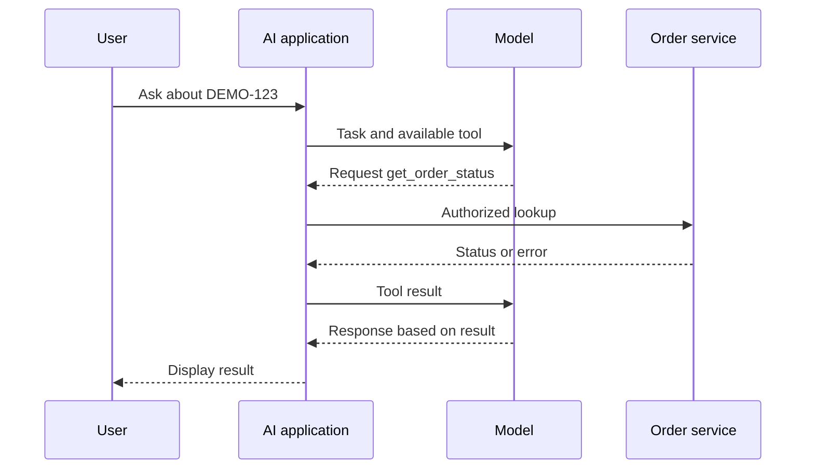

# 08 · Tool calling

**Prerequisite:** [07](07-apis.md). **Goal:** Separate a requested action from execution and success.

## From generating text to requesting a capability

With tool calling, an application makes capabilities available to a model. The model can return a request to use a tool with specified inputs. In a conventional function-calling flow, application code handles the request, executes the permitted operation and supplies the result back to the model. The model can then continue or answer. [OpenAI's function-calling guide](https://developers.openai.com/api/docs/guides/function-calling) describes this flow.

A tool can call an API, run a local function or use another supported mechanism. Tool calling describes how the AI workflow asks to use functionality; API describes a software interface.

## A PM example

A user asks, “Where is order DEMO-123?” The application offers `get_order_status` with an order ID input. The model requests that tool. The application checks the customer's access, looks up the order and returns the result.

This diagram is an illustrative flow; specific products can implement it differently.

## The decision this changes

Define which capabilities should be offered and how their results should be interpreted. A read and a write can require different controls. An attempted operation, a submitted operation and a completed operation should not collapse into the same success message.

A model's request is not, by itself, proof of user authorization. Decide where permission checks and any required confirmation happen before execution.

**Common misconception:** A correctly formatted tool request guarantees a correct action. The inputs may still identify the wrong record, lack permission or conflict with the user's intent.

## Check your understanding

A model returns a request to cancel an order. Has the order been cancelled?

Suggested answer

Not from that evidence alone. The operation must be authorized, executed and confirmed by the underlying system. The user-facing result should reflect the actual outcome.

[← Previous](07-apis.md) · [Next: MCP →](09-mcp.md)
