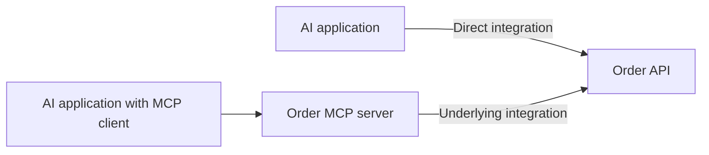

# 10 · What is the difference between API and MCP?

**Prerequisites:** [API](07-apis.md), [tool calling](08-tool-calling.md), [MCP](09-mcp.md). **Goal:** Choose an integration approach for the product's actual consumers.

## The direct answer

**An API defines a software interface. MCP is a particular protocol that standardizes how compatible AI applications communicate with external capabilities and context.** They are not mutually exclusive alternatives: an MCP server can use an existing API. Compare [MDN's API definition](https://developer.mozilla.org/en-US/docs/Glossary/API) with [MCP's official introduction](https://modelcontextprotocol.io/docs/getting-started/intro).

| Question | API | MCP |
| --- | --- | --- |
| What is it? | The broad concept of a software interface. | A specific interoperability protocol for AI applications. |
| What does a consumer use? | The provider's interface contract. | The supported MCP interface and exposed capabilities. |
| What happens behind it? | The service or component implements the operation. | The server implements a capability, possibly through another API. |
| Does it replace the business service? | It exposes access to functionality. | It does not replace that functionality or its implementation. |

These distinctions describe the layers, not a rule that APIs cannot support discovery or AI workflows.

## Follow the same user request through both designs

For a fictional order assistant, the user asks, “Where is order DEMO-123?”

**Direct integration:** the AI application's tool handler knows how to call the order service's API, checks access and returns the status.

**MCP integration:** the application uses a compatible MCP client to call a capability exposed by an order MCP server. That server checks access as appropriate and calls the order service's API. The result returns to the application.

The diagram illustrates one possible architecture, not a requirement that all MCP servers wrap APIs.

## The PM choice

A direct API integration may be sufficient when you control one application, have a narrow task and do not need an interoperability layer. An MCP interface may be useful when several compatible AI clients need a reusable way to access the same capabilities. Assess compatibility and maintenance rather than assuming either design is always cheaper.

Both designs still need correct identity, scoped access, input handling, error handling and observability. The protocol choice does not settle which actions a user authorized.

**Common misconception:** “MCP replaces APIs.” A more useful architecture question is where each interface sits and which consumers it serves.

## Check your understanding

You have a reliable order API and one internal assistant. Must you add MCP to make it an AI product?

Suggested answer

No. A direct tool integration can be sufficient. Consider MCP when interoperability with supported clients creates enough value to justify the additional interface and operating responsibilities.

[← Previous](09-mcp.md) · [Next learning sequence: retrieval and grounding →](ROADMAP.md#stage-3--retrieval-and-grounding) · [Learning guide](README.md)
